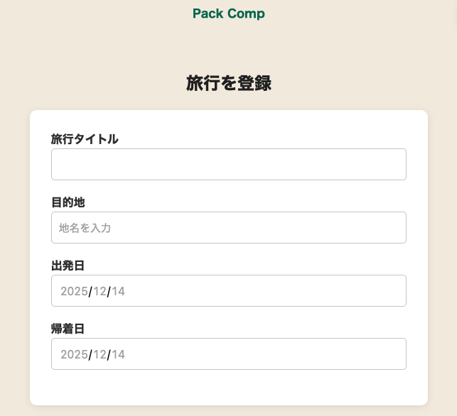
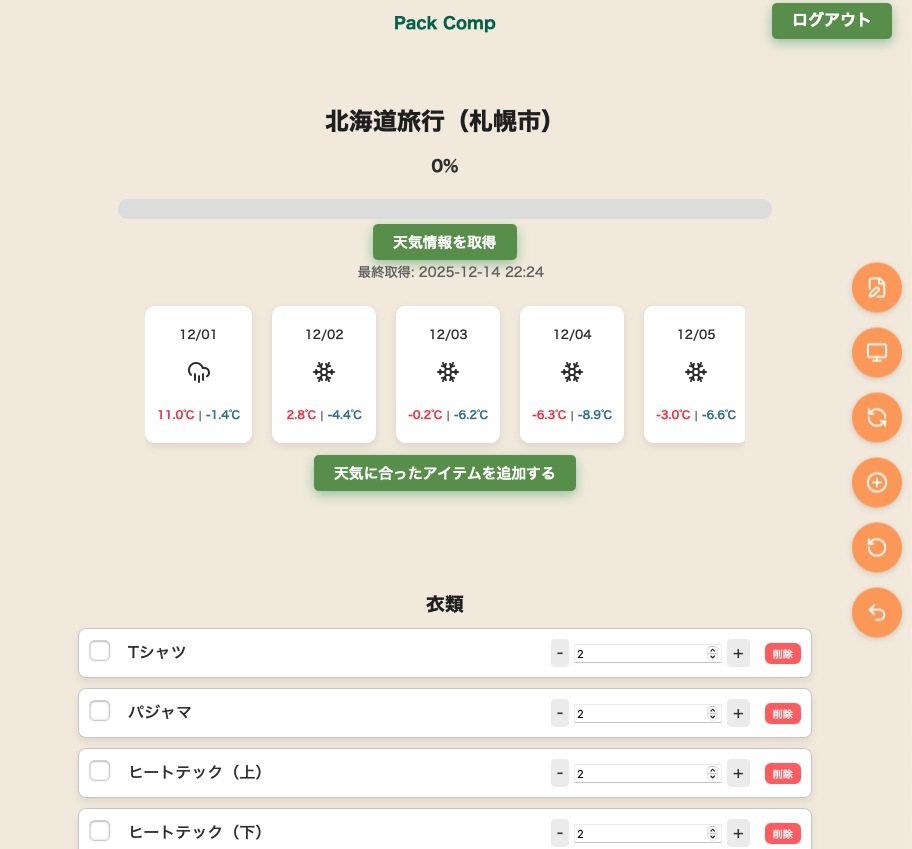
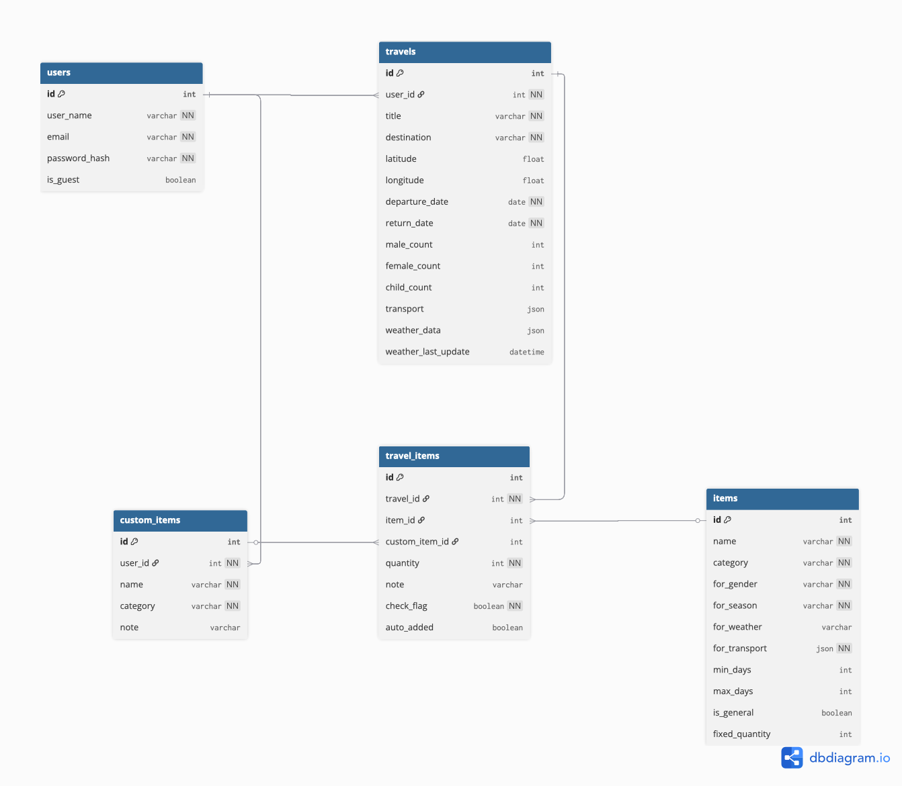
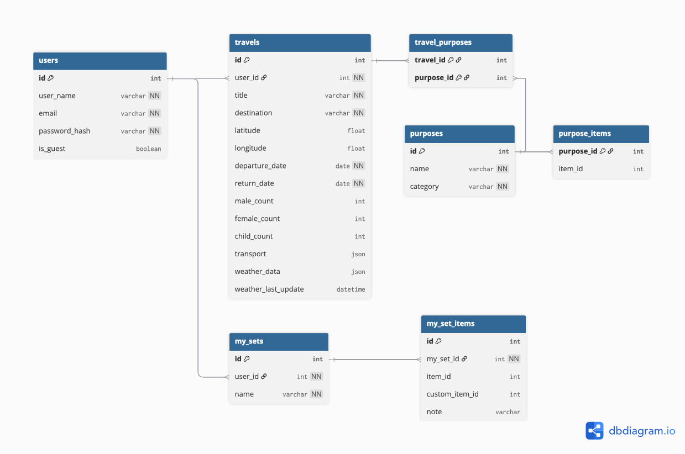

# packcomp
旅行条件から最適な持ち物リストを自動生成し、
ユーザーの編集・再利用までサポートする 旅行準備支援Webアプリです。
「旅行条件を変えるたびに持ち物を考え直すのが面倒」という課題を解決するため、
条件ベースの自動生成とユーザー操作を壊さない設計を重視して開発しました。

---

## デモ
- URL：https://pack-comp.onrender.com
- ゲストログイン対応

---

## 主な機能

- 旅行条件登録（目的地・日程・人数・交通手段）
- 旅行目的選択（観光 / 出張 / アウトドア 等）
- 条件に応じた持ち物リスト自動生成
- 天気情報取得 & 天候対応アイテム提案
- 持ち物の数量調整・削除・進捗チェック
- マイセット機能（持ち物セットの保存・再利用）
- カスタムアイテム作成
- ゲストログイン（ログアウト時データ自動削除）

---

## 画面イメージ

### 旅行条件入力画面

### アイテム一覧画面

---

## 使用技術

### バックエンド
- Python / Flask  
- SQLAlchemy（ORM）
- Flask-Login（認証）
- Flask-WTF（CSRF対策）
- PostgreSQL

### フロントエンド
- HTML / CSS
- JavaScript

### 外部API
- Open-Meteo（天気情報）
- Google Maps Places API（目的地入力補助）

---

## データベース設計

ER図①：コア構造（旅行と持ち物生成）

travel_items を中心に、旅行条件からの自動生成と
ユーザー編集を両立する構造です。

ER図②：再利用・拡張構造

マイセットや旅行目的など、再利用性と拡張性を担う構造です。

---

## 工夫した点

### 自動生成とユーザー編集を両立する設計
旅行条件から持ち物を自動生成しつつ、  
生成後にユーザーが行った **数量変更・削除・追加操作** が  
条件変更や再生成によって失われないように設計しました。

`travel_items` を中心とし、  
- 自動生成されたアイテム  
- ユーザーが追加・編集したアイテム  

を同一構造で管理することで、UXとデータ整合性の両立を意識しています。

再生成についてはユーザー編集内容を壊さないように、差分更新ロジックを適用しています。

---

### 目的地入力と外部API設計の見直し
当初は Nominatim を利用して目的地の緯度・経度を取得していましたが、

- 入力の自由度が高すぎ、表記揺れや入力ミスが起きやすい  
- ユーザーが正しい場所を選べているか分かりにくい  
- APIレスポンスをそのまま扱うことで、仕様変更の影響を受けやすい  

といった課題がありました。

そこで、目的地入力APIを **Google Maps Places API に切り替え**、  
入力途中で候補を提示し、ユーザーが候補から選択できる方式に変更しました。

あわせて、外部APIのレスポンスはそのまま利用せず、  
アプリ側で必要な情報のみを抽出・整形してから扱う構成に見直しています。

---

## 改善点・今後の予定

### UI / UX の改善
現在は機能ごとに画面を分けて実装していますが、  
操作内容によっては画面遷移が多くなるため、  
実際の利用シーンを踏まえてUI改善を検討しています。

- モバイル表示への最適化  
- 不要な画面遷移の削減  
- 持ち物数が多い場合でも操作しやすい一覧表示  

など、準備の手間を減らすことを目的とした改善を想定しています。

---

### 持ち物リストの共有機能
現在はアプリ内で持ち物リストを管理していますが、  
今後はLINEなどのメッセージアプリで  
持ち物リストを共有できる機能を検討しています。

---

### データ再利用性の向上
旅行条件や持ち物構成が似ているケースが多いため、  
既存データをより簡単に再利用できる仕組みを検討しています。

- 過去の旅行を元にした新規旅行の作成  
- マイセットと旅行条件を組み合わせた持ち物生成  

など、入力や設定の手間を減らす改善を想定しています。

---

## 注意事項・補足

### デモ用途を前提とした制限について
本アプリはポートフォリオ用途のデモアプリとして公開しているため、  
実運用を想定した一部の機能や制御は簡略化しています。

- CSRF対策については、API連携やデモ操作を優先し  
  一部エンドポイントで `csrf.exempt` を使用しています  
- 外部APIキーやセキュリティ設定については、  
  本番運用を想定した厳密な管理までは行っていません 

